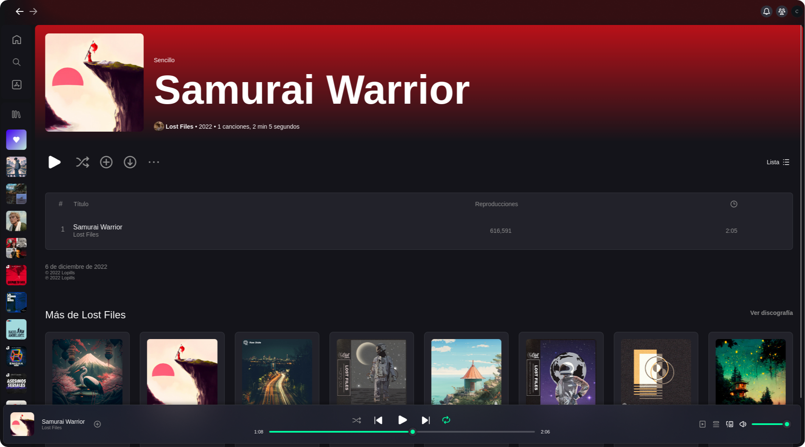

### Hyprland Dotfiles!


Here are some details about my setup:

- **WM:** [hyprland](https://hyprland.org/)
- **OS:** [Fedora](https://fedoraproject.org/)
- **Terminal:** [kitty](https://github.com/kovidgoyal/kitty)
- **Shell:** [fish](https://github.com/fish-shell/fish-shell)
- **Editor:** [neovim](https://github.com/neovim/neovim)
- **Browser:** [firefox](https://www.mozilla.org/en-US/firefox)
- **File Manager:** [thunar](https://github.com/xfce-mirror/thunar)
- **Application Launcher:** [rofi](https://github.com/davatorium/rofi)

---

## Setup.

> This is a basic guide about what my hyprland dotfiles.

### Installation (Manual)

> After cloning the repository, install the necessary dependencies to replicate by setup assuming your using **Fedora**.

```sh
 $ sudo dnf install -S hyprland curl git grim gvfs ImageMagick jq kitty kvantum neovim network-manager-applet openssl pamixer pavucontrol pipewire-alsa playerctl polkit-gnome python3-request pyton3-pip qt5ct qt5ct qt6-qtsvg rofi-wayland
```

> Then after the dependencies are installed, copy the files to it's respective folders.

```sh
 $ cp -r ./config/* $HOME/.config/
 $ mkdir -p $HOME/.local/bin/ && cp -r ./bin/* $HOME/.local/bin/
```

> You will need to install a few fonts.

- **JetBrainsMono NF:** [here](https://github.com/ryanoasis/nerd-fonts)
- **Font Awesome:** [here](https://fontawesome.com/download)
- **CaskaydiaCove NerdFont :** [here](https://www.nerdfonts.com/font-downloads)

> Once finished copying the files, you might want to change your shell.

```sh
 # Change your shell to fish
 $ chsh -s /usr/bin/fish
```

## Miscellaneous.

- **Spicetify theme**

  > Im using Bloom Theme if your interested you can install [spicetify](https://spicetify.app/)



## Acknowledgements.

- **Thanks to**

  - [JaKoolLit](https://github.com/JaKooLit/) for some scripts and configs.
   <br>
